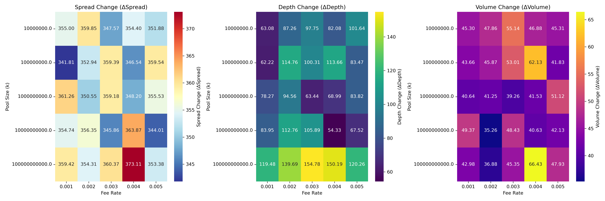
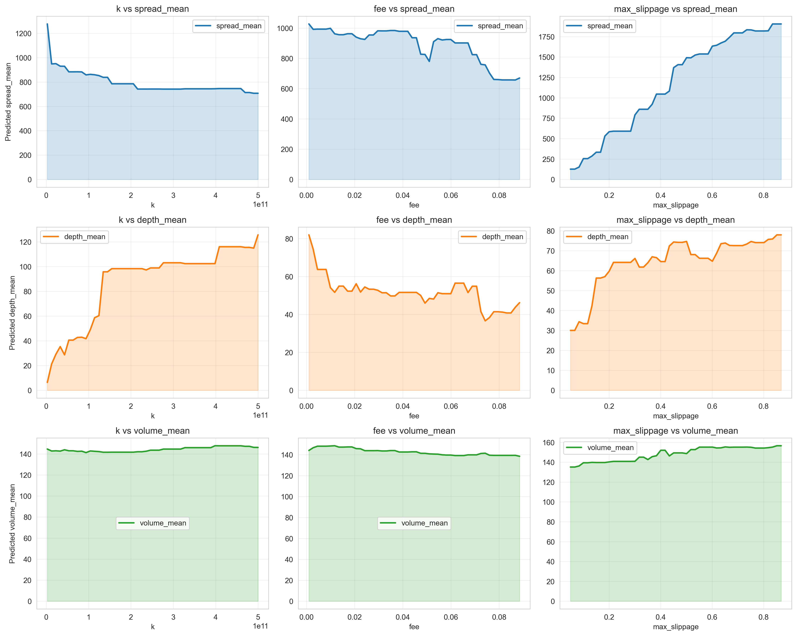
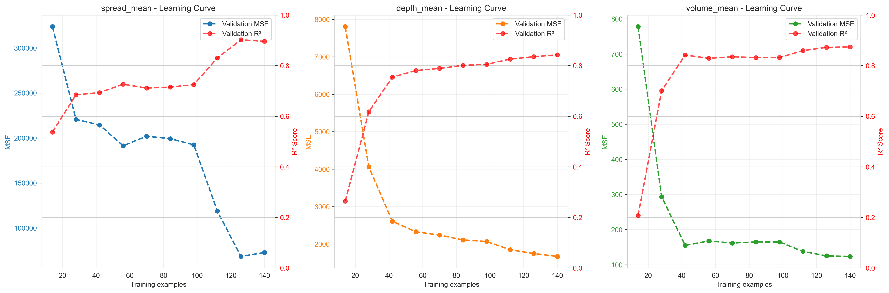
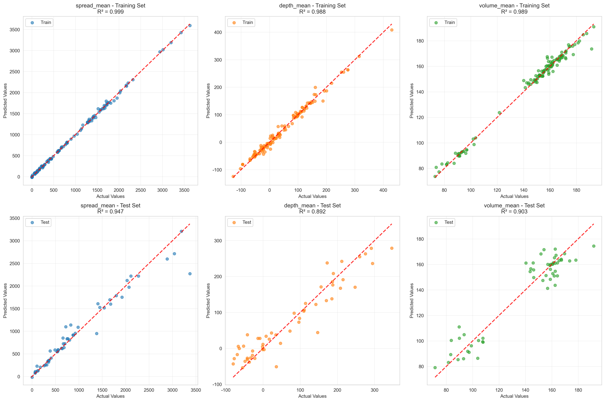
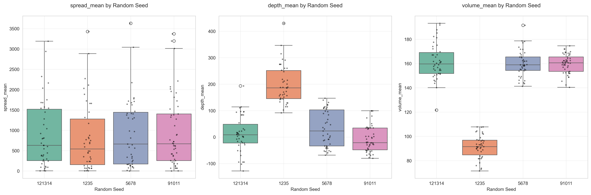
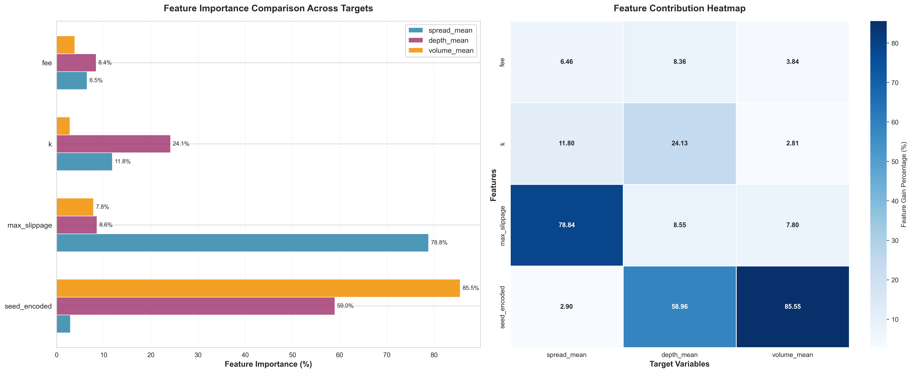
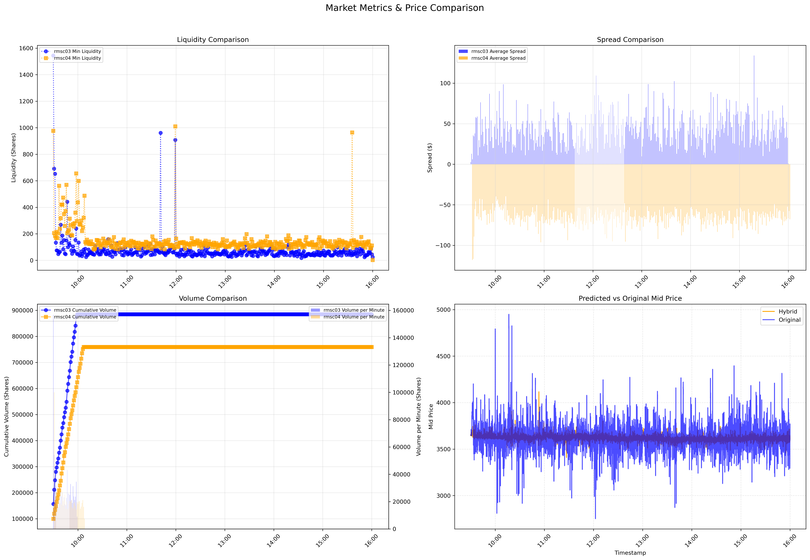

### 1. 验证hybrid模型符合真实市场。

#### 1️⃣价格对比图

 

#### 2️⃣正态分布图（未做）

### 2. 主结果：

#### 1️⃣呈现Δs/Δd/Δv以及共生性得分，与k、rate之间的关系。

##### 画热力图（未更新）

##### 基于xgboost预测部分依赖关系（partial dependence）

补充xgboost学习性能：

#### 2️⃣k和手续费的balance point

##### 3D版

  

balance point为图中底下莓红色区域：

- Threshold T1 (45th percentile): 1.04
- Threshold T2 (55th percentile): 1.32

1. **极高分区域 (The Peak) 的参数特征**

- **位置:** 图中最突出的、最高的红色尖峰。
- **参数特征:**
  - **$\log_{10}(k)$ (Pool Size):** 集中在较高的值域，大约在 $\mathbf{11.5}$ 到 $\mathbf{12.0}$ 之间（即 $k \approx 10^{11.5}$ 到 $10^{12}$）。
  - **$\text{Fee}$:** 集中在 **最高** 的值域，大约在 $\mathbf{0.08}$ 到 $\mathbf{0.10}$ 之间。

2. **核心结论**

这幅图传达了与传统直觉可能相反，但却非常明确的结论：

1. **高 $\text{Fee}$ 才是实现最高分的必要条件:** 系统的最佳性能（Coexistence Score > 140）出现在 $\text{Fee}$ 处于**最大值附近** ($\text{fee} \approx 0.10$) 的区域。这表明，对于这个特定的模型和市场环境：
   - **高费用** 可以有效阻止套利者（Arbitragers）频繁交易，**减少价差（Spread）** 的波动。**$\text{Spread}$ 降低**，从而根据 Coexistence Score 的计算公式 $\left(\frac{\text{Depth} + \text{Volume}}{1 + |\text{Spread}|}\right)$，**分数被大幅拉高**。
2. **$k$ (Pool Size) 仍是基础:** 即使 $\text{Fee}$ 很高 ($\approx 0.10$)，如果 $\log_{10}(k)$ 很低（例如低于 $11.0$），Coexistence Score 仍然很低。这说明**巨大的流动性池 ($k > 10^{11.5}$) 是实现高分的基础**。

##### 2D版

  

### 3. 稳健性检验：

##### 换随机种子（未更新）

##### 换分布（未做）

##### 换agent数量（未做）

##### 换crypto品种（未做）

### 4. 一些描述性统计分析

##### 数据相关图（未更新）

##### xgboost特征重要性图（未更新）

##### 指标随时间变化图（未更新）

