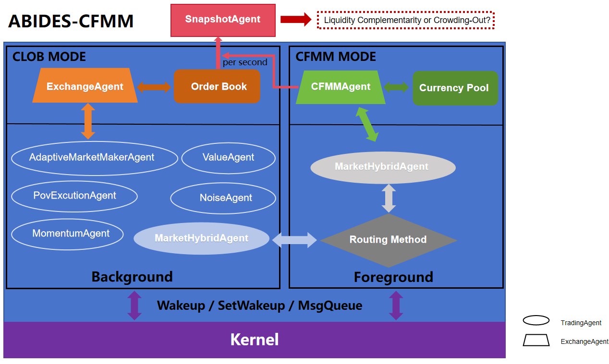

当模拟开始时，**Kernel** Wakeup 所有Agent完成各自的初始化，TradingAgent每次被唤醒都会执行一套预设的行为逻辑：

1. 首先是获取数据：
   - CLOB市场：通过kernel的 MsgQueue”机制与ExchangeAgent之间完成CLOB的市场信息的询问与data结果的传递。
   - 至于CFMM市场，MarketHybridAgent使用CFMMAgent（继承自ExchangeAgent）提供的一组静态类函数接口来获取相应的cfmm market data信息。
2. 获取完信息，TradingAgent需要进行决策交易（除了snapshotAgent只负责记录市场快照，其他TradingAgent的交易逻辑见ABIDES原文，MarketHybridAgent因为是混合市场交易，交易逻辑遵循一套固定的Routing method见后文图）
3. TradingAgent的交易请求会被ExchangeAgent或者CFMMAgent收到并执行，同时更新订单簿Order book和货币池Currency pool里的信息。

TradingAgent 每次被唤醒都会通过SetWakeup 设置下次被唤醒的时间。整个流程在Kernel的调度下，各组件通过消息队列和唤醒机制持续推进，完成每个时刻的市场交易、数据快照。直到Kernel判断当前时间大于mkt_close的时间，终止进程。